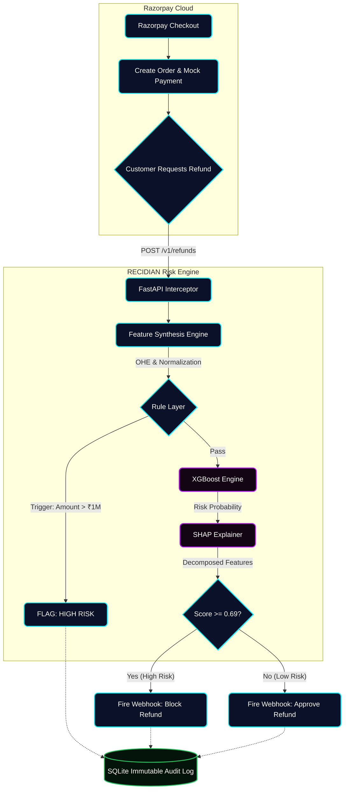

# RECIDIAN — Return-Risk Intelligence Engine

*Not every return is a loss. RECIDIAN tells you which ones are.*

[](https://recidian.onrender.com)
[](#)

**Live Demo:** [https://recidian.onrender.com](https://recidian.onrender.com)  
*(Note: Hosted on Render Free Tier. Please allow 60-90 seconds for the initial cold start if the server is asleep).*

---

## 🎯 Problem Statement & Track Alignment
**The Hackathon Mandate (Track 02 - AI Risk Manager):**
> *"Stop the merchant losing money to fraud, returns and chargebacks. Build a working detector, verifier or auto-responder for one class of loss, with measured precision and recall on a held-out test set... strictly defense-only."*

**The RECIDIAN Solution:**
We explicitly targeted **Return Abuse** (Wardrobing, Promo-exploitation, Serial returning). RECIDIAN is a **strictly defense-only** ML interceptor. It listens passively to Razorpay's `/v1/refunds` API, synthesizes historical account velocity, and scores the risk of an incoming refund *before* it is approved, saving merchant revenue and operational costs. 

---

## ⚡ Key USPs & Features

1. **Business Cost Optimization (Not just "Accuracy"):** We didn't optimize for arbitrary ML accuracy. We assigned a financial penalty to False Positives (insulting a good customer) and False Negatives (shipping cost + loss), sweeping 99 thresholds to find the mathematical minimum business loss at exactly **Threshold = 0.69**.
2. **SHAP Explainability (No Black Boxes):** In real FinTech, freezing money blindly is a compliance nightmare. We integrated a SHAP `TreeExplainer`. Every prediction outputs exact feature contributions (e.g., *"Blocked because the user's 90-day return rate is 80%"*), ensuring total operational transparency.
3. **Hybrid Scoring Architecture:** We built a hardcoded rule layer for 0ms instant triggers (speed), backed by a powerful XGBoost Classifier for complex, non-linear pattern recognition.
4. **Archetype-Driven Synthetic Data:** We reverse-engineered Razorpay API schemas to generate 20,400+ transactions. We purposely injected a "Loyal High-Frequency Shopper" archetype as a *hard negative* to force the model to learn nuanced behaviors, rather than just banning everyone who returns an item.

---

## 📊 Evaluation Metrics (Held-Out Test Set)
| Metric | Value | Meaning |
|---|---|---|
| **Precision** | `94.3%` | When we flag a refund as high-risk, we are correct 94.3% of the time. |
| **Recall** | `93.0%` | We caught 93.0% of all abusive returns in the dataset. |
| **ROC-AUC** | `0.994` | The model has excellent class separation capability. |
| **PR-AUC** | `0.940` | Highly resilient even against class imbalance. |
| **Business Cost**| `INR 36,550` | The minimum possible loss achieved on the test set via Threshold Sweep. |

---

## 🏛️ Architecture Flow



---

## 💻 Local Setup

1. **Clone the Repository**
   ```bash
   git clone https://github.com/dsouzkie/Recidian.git
   cd Recidian
   ```
2. **Install Dependencies**
   ```bash
   pip install -r requirements.txt
   ```
3. **Environment Variables**
   Create a `.env` file containing your Razorpay Test Keys:
   ```
   RAZORPAY_KEY_ID=rzp_test_xxxxxxx
   RAZORPAY_KEY_SECRET=xxxxxxxxxxxx
   ```
4. **Run the Backend**
   ```bash
   python -m uvicorn src.app:app --host 0.0.0.0 --port 8000
   ```
5. **View the Dashboard**
   Navigate to `http://localhost:8000` (which auto-redirects to the dashboard).

---

## 🚀 Future Roadmap
- **Peer-Group Normalization:** Add relative Z-scores (e.g., comparing a customer's return rate to the average for their specific product category, since clothes are returned more often than electronics).
- **Network Graph Analysis:** Implement graph databases to detect 'Abuse Rings' (multiple accounts sharing the same device fingerprint or IP address to bypass blocks).
