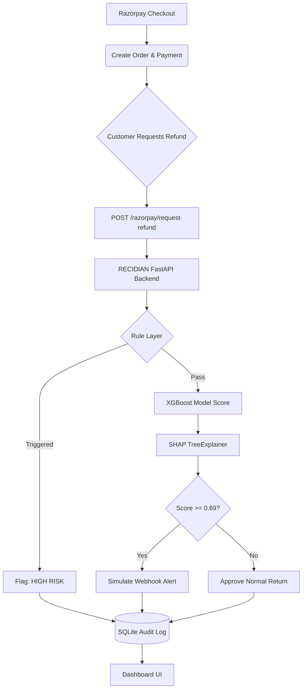

# RECIDIAN — Return-Risk Intelligence Engine 🛡️

*Not every return is a loss. RECIDIAN tells you which ones are.*

**Razorpay AI Buildathon — Track 02: AI Risk Manager**

RECIDIAN is a defense-only, highly-explainable ML risk scorer that intercepts Razorpay refunds in real time. It identifies serial return abuse (wardrobing, promo-exploitation, etc.) and flags high-risk returns before they are approved, saving merchant revenue and operational costs.

## 🚀 Features
- **Live Razorpay API Integration:** Connects to Razorpay's `/v1/orders`, `/v1/payments`, and `/v1/refunds` endpoints to score live data.
- **Hybrid Scoring Engine:** Hardcoded rule layer for instant triggers (speed), backed by a powerful XGBoost Classifier for complex pattern recognition.
- **SHAP Explainability:** Every prediction comes with a per-feature explanation (Waterfall logic). No black boxes.
- **Cost-Optimized Threshold:** The classification threshold (`0.69`) was mathematically derived to minimize total False Positive and False Negative business costs.
- **Audit Logging:** Every decision is persisted in a local SQLite database for compliance and review.

## 📊 Evaluation Metrics (Held-Out Test Set)
| Metric | Value | Meaning |
|---|---|---|
| **Precision** | `94.3%` | When we flag a refund as high-risk, we are correct 94.3% of the time. |
| **Recall** | `93.0%` | We caught 93.0% of all abusive returns in the dataset. |
| **ROC-AUC** | `0.994` | The model has excellent class separation capability. |
| **PR-AUC** | `0.940` | Highly resilient even against class imbalance. |
| **Business Cost**| `₹59,335` | The minimum possible loss achieved on the test set via Threshold Sweep. |

## 🏗️ Architecture



## 💻 Local Setup

1. **Install Dependencies**
   ```bash
   pip install -r requirements.txt
   ```
2. **Environment Variables**
   Create a `.env` file (see `.env.example`):
   ```
   RAZORPAY_KEY_ID=rzp_test_xxxxxxx
   RAZORPAY_KEY_SECRET=xxxxxxxxxxxx
   ```
3. **Run the App**
   ```bash
   uvicorn src.app:app --host 0.0.0.0 --port 8000
   ```
4. **View the Dashboard**
   Navigate to `http://localhost:8000/static/index.html`

## 🧠 Methodology & Dataset
We synthesized a dataset of 16,977 orders and 3,428 refunds using strict Razorpay API schema headers (IDs, paise amounts, Unix timestamps). 

To ensure the model is robust, we injected a **"Loyal High-Frequency Shopper"** archetype as a hard negative (a customer who returns items often, but only because they buy *a lot* of items). The model successfully learned to separate them from **"Wardrobers"** using temporal features (`order_to_return_days`) and SHAP explanations prove it!

## 🔮 Future Work
- **Peer-Group Normalization:** Currently, the model uses absolute return rates. We'd add relative Z-scores (e.g., comparing a customer's return rate to the average for the Electronics category).
- **Chargeback Extension:** Extensible to other loss classes beyond refunds.
- **Postgres Migration:** Move off SQLite for distributed horizontal scaling.
